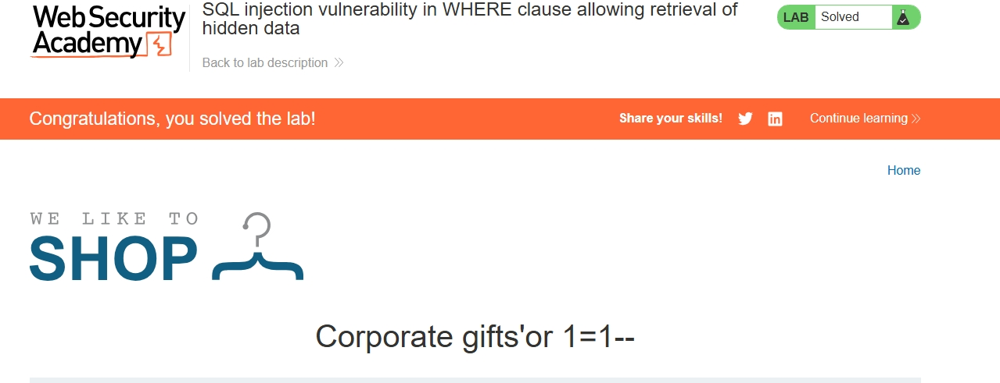

# Lab 02 – SQL Injection in WHERE Clause (Retrieving Hidden Data)

## Objective

This lab focused on **SQL injection in a WHERE clause** to retrieve data that is not normally visible to the user. The goal was to exploit a SQL injection vulnerability in a search/filter parameter to extract hidden information from the database — specifically, bypassing the application's data filtering to retrieve all records or hidden entries.

This builds on Lab 1's authentication bypass by demonstrating a different SQL injection impact: **data retrieval** rather than login bypass.

## What I Learned

- **SQL injection in WHERE clauses** — how a vulnerable query that filters data (e.g., `SELECT * FROM products WHERE name = '$input'`) can be manipulated to return more data than intended.
- **Tautology-based injection** — using expressions like `OR 1=1` or `OR '1'='1'` to make the WHERE condition always true, thereby returning all rows instead of just the matching ones.
- **SQL comment syntax** — using `--` to truncate the rest of the query (e.g., removing additional conditions like `AND ACTIVE = 1`).
- **URL-based injection** — modifying URL parameters directly in the browser address bar to inject SQL payloads, without needing a proxy tool.
- **HTTP 500 / error clues** — understanding that server errors can indicate the payload is affecting the query, even if the desired data isn't yet returned.
- **Impact of SQL injection beyond authentication** — SQLi can be used to extract hidden data, enumerate database contents, and in some cases modify or delete data.
- **Remediation** — the correct fix is **parameterized queries / prepared statements**, so user input is never concatenated into SQL.

## Topics Covered

- SQL injection (WHERE clause manipulation)
- Tautology-based SQL injection (`OR 1=1`, `OR '1'='1'`)
- SQL comment syntax (`--`)
- URL parameter injection
- Retrieving hidden/extra data via SQL injection
- Secure coding practices: parameterized queries / prepared statements

## Practical Work

### Lab Environment

- **Platform:** PortSwigger Web Security Academy (intentionally vulnerable labs)
- **Lab:** SQL injection vulnerability in WHERE clause allowing retrieval of hidden data
- **Difficulty:** Apprentice (straightforward)

### Steps Completed

1. Navigated to the **Web Security Academy dashboard** → **SQL Injection** topic.
2. Launched the lab **"SQL injection vulnerability in WHERE clause allowing retrieval of hidden data"**.
3. Explored the vulnerable application, which included a searchable product listing with an input parameter (in the URL).
4. Identified the input parameter that was passed into a SQL WHERE clause.
5. Experimented with SQL injection payloads directly in the URL:

   - Used a tautology payload (`or+1=1--`, URL-encoded) to make the WHERE condition always true.
   - The `--` comment truncated the rest of the query, removing any additional filtering conditions.

6. The payload caused the application to return data that was previously hidden/filtered — confirming the SQL injection worked.
7. Confirmed completion via the green **"LAB Solved"** badge and "Congratulations" message.

### Evidence

The screenshot below shows the **Lab Solved** confirmation:

*Screenshot shows the green "LAB Solved" badge, the "Congratulations, you solved the lab!" banner, and the payload used to complete the lab.*

### Final Outcome

The SQL injection payload manipulated the WHERE clause so that the application returned hidden/extra data. The lab confirmed that even a simple tautology combined with a SQL comment can bypass data filtering and retrieve information that should not be accessible.

## Tools Used

| Tool | Purpose |
|---|---|
| PortSwigger Web Security Academy | Intentionally vulnerable web security labs (browser-based, no installation required) |
| Web browser (Microsoft Edge) | Used to access the lab and modify URL parameters directly |
| Burp Suite Community Edition | **Not used** in this lab — all testing was done directly via the browser and URL manipulation |

> **Note:** Burp Suite was installed and configured during this learning period but was not required for this particular lab, which could be solved through direct URL manipulation.

## Key Takeaways

1. **SQL injection can retrieve hidden data** — not just bypass login. A WHERE clause vulnerability can expose data the application intended to keep filtered or private.
2. **Simple payloads can be effective** — a basic tautology (`OR 1=1`) combined with a comment (`--`) was enough to exploit this lab, showing that sophistication is not always required.
3. **URL parameters are attack surface** — any user-controlled input passed into a SQL query (including URL parameters) can be exploited if not properly handled.
4. **Browser-only testing is sometimes enough** — for simple labs, direct URL manipulation in the browser can demonstrate the vulnerability without additional tooling.
5. **Parameterized queries are the fix** — the root cause is string concatenation in SQL. Using prepared statements / parameterized queries prevents this class of vulnerability regardless of the injection technique.

## Evidence

- **Lab completion status:** ✅ Solved (green "LAB Solved" badge on PortSwigger Web Security Academy)
- **Date solved:** 2026-09-04
- **Evidence file:** `screenshot-solved.jpg` (screenshot of the solved lab page)

## Conclusion

In this lab, I successfully exploited a **SQL injection vulnerability in a WHERE clause** to retrieve hidden data from the database. This demonstrated a different impact of SQL injection compared to Lab 1 (authentication bypass) — here the impact was **data exposure**. The lab reinforced the importance of parameterized queries and showed that even simple payloads can have significant impact when user input is concatenated directly into SQL queries. This lab is part of a progressive learning path in web application security.

---

*Documented as part of the `web-security-lab` repository.*
