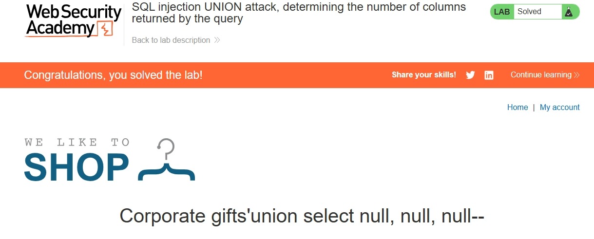

# Lab 03 – SQL Injection UNION Attack: Determining the Number of Columns

## Objective

This lab focused on the first step of a **SQL injection UNION attack**: determining the number of columns returned by the original query. Before a UNION-based attack can extract data from other tables, the attacker must know how many columns the application's SQL query returns, so the UNION SELECT statement has the correct number of columns with compatible data types.

The specific objective was to determine the column count of the SQL query used by the vulnerable application and confirm the correct number.

## What I Learned

- **UNION attack prerequisites** — before extracting data via UNION, you need to know the column count and which columns can hold the data type you want to retrieve.
- **Determining column count via UNION SELECT NULL** — by incrementally adding `NULL` values to a `UNION SELECT` statement, you can determine how many columns the original query returns. When the number of NULLs matches the column count, the query succeeds without error.
- **SQL comment syntax** — using `--` to truncate the rest of the query, removing additional conditions that might interfere with the UNION.
- **String termination** — closing the original string value with a `'` (or `%27` in URL-encoded form) before the UNION payload takes effect.
- **Using Burp Suite Repeater** — intercepting the request with Burp, sending it to Repeater, and iteratively modifying the payload to test different column counts.
- **Challenges of UNION attacks** — column count must be exact; too few or too many NULLs causes an error; data types must be compatible across UNION columns.

## Topics Covered

- SQL injection UNION attack
- Determining the number of columns in a SQL query
- `UNION SELECT NULL` technique
- SQL comment syntax (`--`)
- URL-encoded SQL injection payloads
- Burp Suite Proxy and Repeater workflow
- Secure coding practices: parameterized queries / prepared statements

## Practical Work

### Lab Environment

- **Platform:** PortSwigger Web Security Academy (intentionally vulnerable labs)
- **Lab:** SQL injection UNION attack, determining the number of columns returned by the query
- **Difficulty:** Practitioner

### Steps Completed

1. Navigated to the **Web Security Academy dashboard** → **SQL Injection** topic.
2. Launched the lab **"SQL injection UNION attack, determining the number of columns returned by the query"**.
3. Opened **Burp Suite Community Edition** and configured the browser proxy to `127.0.0.1:8080`.
4. Turned on **Intercept** in Burp to capture the lab's HTTP requests.
5. Explored the vulnerable application and identified the **`category` parameter** in the URL (`/filter?category=...`) as the injection point.
6. Intercepted the request in Burp and **sent it to Repeater** for iterative testing.
7. Used `UNION SELECT NULL` with increasing numbers of NULL values to determine the column count:

   - Started with 1 NULL → query failed (column count mismatch)
   - Tried 2 NULLs → query failed (column count mismatch)
   - Tried 3 NULLs → query succeeded (column count matched)

8. Confirmed the column count was **3** (the original query returns 3 columns).
9. Verified completion via the green **"LAB Solved"** badge and "Congratulations" message.

### Evidence

The screenshot below shows the **Lab Solved** confirmation and the payload used:

*Screenshot shows the green "LAB Solved" badge, the "Congratulations, you solved the lab!" banner, and the payload `Corporate gifts'union select null, null, null--` used to determine the column count.*

### Final Outcome

The `UNION SELECT NULL, NULL, NULL--` payload (with 3 NULLs) matched the 3 columns returned by the original query, confirming the column count. This is the foundational step for any subsequent UNION-based data extraction.

## Tools Used

| Tool | Purpose |
|---|---|
| PortSwigger Web Security Academy | Intentionally vulnerable web security labs (browser-based, no installation required) |
| Microsoft Edge | Web browser used to access the lab |
| Burp Suite Community Edition (Proxy + Repeater) | Intercepted HTTP traffic, sent requests to Repeater, and iteratively tested UNION SELECT NULL payloads to determine column count |

## Key Takeaways

1. **Column count is foundational** — you cannot build a successful UNION attack without knowing how many columns the original query returns.
2. **UNION SELECT NULL is a reliable technique** — NULL works as a placeholder for any data type, so it can be used to probe column count without needing to know the actual data types.
3. **Iterative testing is normal** — testing 1 NULL, then 2, then 3, etc., is the standard approach. Each attempt either succeeds or fails, giving you information.
4. **Burp Repeater speeds up testing** — sending the request to Repeater and modifying the payload there is much faster than going through the browser each time.
5. **Small details matter** — closing the string with `'`, using `--` to comment out the rest of the query, and URL-encoding special characters all affect whether the payload works.
6. **Parameterized queries prevent this** — the root cause is string concatenation in SQL. Prepared statements / parameterized queries would prevent this entire class of vulnerability.

## Evidence

- **Lab completion status:** ✅ Solved (green "LAB Solved" badge on PortSwigger Web Security Academy)
- **Date solved:** 2026-09-04
- **Evidence file:** `screenshot-solved.jpg` (screenshot of the solved lab page, including the payload used)

## Conclusion

In this lab, I successfully determined the number of columns returned by the application's SQL query using a **UNION SELECT NULL** technique with Burp Suite Repeater. This confirmed the column count was 3. This lab is the first step in the UNION attack series and provides the foundation for subsequent labs that extract data from other tables. The hands-on experience with Burp Suite's Proxy and Repeater tools also built practical skill in intercepting and modifying HTTP requests for security testing. This lab is part of a progressive learning path in web application security and SQL injection.

---

*Documented as part of the `web-security-lab` repository.*
