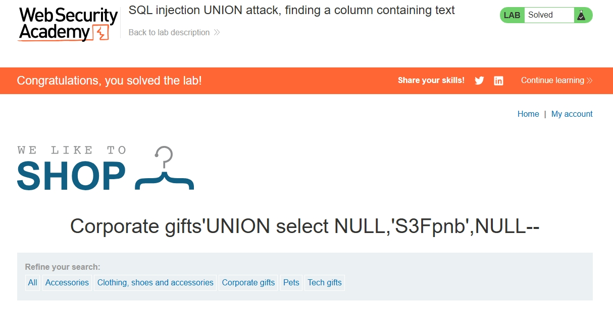

# Lab 04 – SQL Injection UNION Attack: Finding a Column Containing Text

## Objective

This lab focused on the second step of a **SQL injection UNION attack**: after determining the number of columns in the query (done in Lab 3), the goal was to identify **which column can hold text data**. This is necessary because to extract data from the database (e.g., usernames, passwords, table names), the attacker must use a column that can display string values in the application's response.

The specific objective was to find the text-holding column by testing each column position with a string payload and observing where it appears in the application's output.

## What I Learned

- **Why column type matters in UNION attacks** — not all columns can display text. A UNION SELECT with a string in a numeric column will fail or not display. The attacker must find a column whose data type is compatible with the string being injected.
- **Testing columns one at a time** — the standard approach is to place a test string (e.g., `'test'` or a unique marker) in each column position while keeping the others as `NULL`, then check the response to see where the string appears.
- **Error analysis as feedback** — during this lab, an initial payload with an extra `NULL` (and a missing comma) caused a 500 Internal Server Error. This showed that the query structure must be exactly right: the correct number of items, separated by commas, with no extras.
- **Using Burp Suite Repeater** — modifying the payload iteratively in Repeater, sending it, and checking the response (especially the **Render** tab) to see where the test string appears.
- **URL encoding** — special characters like `'`, spaces, and commas must be properly URL-encoded in the request for the payload to be interpreted correctly by the server.
- **The importance of debugging syntax errors** — a 500 error is not a dead end; it often indicates a syntax problem in the payload that can be fixed by reviewing the query structure.

## Topics Covered

- SQL injection UNION attack
- Finding a column containing text
- UNION SELECT with string testing
- SQL error analysis (HTTP 500 as feedback)
- Burp Suite Repeater workflow (modify, send, inspect response)
- URL encoding of SQL injection payloads
- Secure coding practices: parameterized queries / prepared statements

## Practical Work

### Lab Environment

- **Platform:** PortSwigger Web Security Academy (intentionally vulnerable labs)
- **Lab:** SQL injection UNION attack, finding a column containing text
- **Difficulty:** Practitioner

### Steps Completed

1. Navigated to the **Web Security Academy dashboard** → **SQL Injection** topic.
2. Launched the lab **"SQL injection UNION attack, finding a column containing text"**.
3. Opened **Burp Suite Community Edition**, configured the browser proxy to `127.0.0.1:8080`, and turned **Intercept ON**.
4. Explored the vulnerable application and identified the **`category` parameter** in the URL (`/filter?category=...`) as the injection point.
5. Intercepted the request in Burp and **sent it to Repeater** for iterative testing.
6. Remembered the column count from Lab 3: **3 columns**.
7. Tested each column position with a string payload to find which one displays text:

   - **Column 1 test:** `UNION SELECT 'test', NULL, NULL--` — string did not appear in response
   - **Column 2 test:** `UNION SELECT NULL, 'test', NULL--` — string appeared in the response ✅
   - **Column 3 test:** `UNION SELECT NULL, NULL, 'test'--` — string did not appear in response

8. Confirmed that **column 2** is the text-holding column.
9. Used the specific string provided by the lab (`'S3Fpnb'`) in column 2 to complete the lab:

   ```
   UNION SELECT NULL, 'S3Fpnb', NULL--
   ```

10. Confirmed completion via the green **"LAB Solved"** badge and "Congratulations" message.

### Issues Encountered and Fixed

During testing, an initial payload was sent with an **extra `NULL`** and a **missing comma**:

```
UNION SELECT NULL,NULL,'S3Fpnb' NULL--     ← incorrect (extra NULL, missing comma)
```

This caused a **500 Internal Server Error** because the SQL parser saw `'S3Fpnb' NULL` as a malformed expression (a string literal next to `NULL` with no operator).

**Fixed payload:**

```
UNION SELECT NULL, 'S3Fpnb', NULL--          ← correct (3 items, commas between each)
```

This showed the importance of:
- Using the **exact column count** (3 items for 3 columns)
- Placing a **comma** between each item
- Not adding **extra** items beyond the column count

### Evidence

The screenshot below shows the **Lab Solved** confirmation and the payload used:



*Screenshot shows the green "LAB Solved" badge, the "Congratulations, you solved the lab!" banner, and the payload `Corporate gifts'UNION select NULL,'S3Fpnb',NULL--` used to complete the lab.*

### Final Outcome

Column 2 was identified as the text-holding column. The lab was completed by placing the required string (`'S3Fpnb'`) in column 2 and confirming it appeared in the application's response.

## Tools Used

| Tool | Purpose |
|---|---|
| PortSwigger Web Security Academy | Intentionally vulnerable web security labs (browser-based) |
| Microsoft Edge | Web browser used to access the lab |
| Burp Suite Community Edition (Proxy + Repeater) | Intercepted HTTP traffic, sent requests to Repeater, iteratively tested payloads, and inspected the response (especially the Render tab) to see where the test string appeared |

## Key Takeaways

1. **Not all columns can display text** — finding the text-compatible column is a required step before data extraction in a UNION attack.
2. **Test columns methodically** — one at a time, with a unique string, checking the response (rendered or via search) to see where it appears.
3. **Syntax errors cause 500s** — an extra NULL or missing comma made the query fail. Reading the error as feedback, not a dead end, is key to debugging.
4. **Burp Repeater is essential here** — modifying payloads and checking responses quickly is much faster in Repeater than through the browser.
5. **Column count must match exactly** — the number of items in the UNION SELECT must equal the number of columns. Too few or too many causes an error.
6. **Parameterized queries prevent this** — the root cause is string concatenation in SQL. Prepared statements would prevent this entire class of vulnerability.

## Evidence

- **Lab completion status:** ✅ Solved (green "LAB Solved" badge on PortSwigger Web Security Academy)
- **Date solved:** 2026-09-20
- **Evidence file:** `screenshot-solved.jpg` (screenshot of the solved lab page, showing the payload used)

## Conclusion

In this lab, I successfully identified the text-holding column (column 2) in a SQL query using a UNION SELECT approach with iterative testing in Burp Suite Repeater. This completed the second step of the UNION attack chain — after determining the column count (Lab 3), finding the text column (Lab 4) sets up the final step of extracting data from other tables. The lab also reinforced the importance of correct SQL syntax, as an initial payload with an extra NULL and missing comma caused a 500 error that had to be debugged. This lab is part of a progressive learning path in SQL injection and web application security.

---

*Documented as part of the `web-security-lab` repository.*
